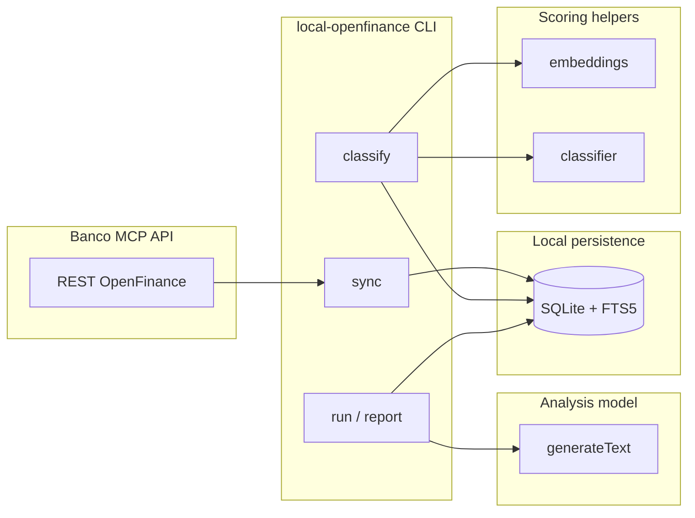

# PLAN — local-openfinance

Implementation roadmap for syncing [Banco MCP](https://banco.mcp.ai/) Open Finance data into a local SQLite database, annotating expenses and investments, and producing LLM-driven reports.

The OpenAPI contract lives in [`banco-mcp-openapi.json`](./banco-mcp-openapi.json). This document is the engineering plan; [`README.md`](./README.md) is the user-facing guide; [`AGENTS.md`](./AGENTS.md) is the agent/human operational reference.

## Goals

1. **Full local mirror** — Incrementally sync every read endpoint in `banco-mcp-openapi.json` into SQLite.
2. **Fast queries** — FTS5 on text fields; B-tree indexes on timestamps and foreign keys for JOINs and date grouping.
3. **Annotation workflow** — Manual classification with embedding-backed similarity search and optional classifier helpers.
4. **Multi-account reality** — Model transfers between accounts, credit-card payments, and investment flows as linked movements.
5. **Reporting** — Chronological LLM input with ISO8601 local timestamps, account/label/annotation attributes, prompt + JSON schema validation.
6. **CLI ergonomics** — `yargs` with one command file each; `@inquirer/prompts` for wizards; `chalk` / `marked-terminal` for output.

## Non-goals (v0)

- Writing back to Banco MCP except optional `openfinance_update_transaction_category` when the user explicitly confirms a category fix upstream.
- Real-time push updates (polling/sync on demand only).

Local web UI is specified in [`PLAN_WEB_APP.md`](./PLAN_WEB_APP.md) and served via the `serve` command.

## Architecture



### Layer responsibilities

| Layer | Path | Responsibility |
|-------|------|----------------|
| CLI | `src/commands/*.ts` | User-facing commands; no business logic duplication |
| Config | `src/config/` | Ajv validation, path resolution, defaults |
| Open Finance client | `src/openfinance/client.ts` | Typed POST wrappers for each `operationId` |
| Sync engine | `src/openfinance/sync/` | Incremental fetch, upsert, cursor bookkeeping |
| Database | `src/db/` | Migrations and queries via `node:sqlite` `DatabaseSync` |
| Annotation | `src/annotation/` | Categories, embeddings, similarity, classifier hints |
| Transfers | `src/transfers/` | Heuristic linking of related movements across accounts |
| LLM | `src/llm/` | Prompt compile, segmentation, generate, validate (reuse skeleton patterns) |
| State | `src/state/` | Compact in-memory report state builder (no JSON state file for now) |
| Scoring | `src/scoring/` | Embedding/classifier provider wiring |

## SQLite design

Use the built-in [`node:sqlite`](https://nodejs.org/api/sqlite.html) module (`DatabaseSync`, synchronous API). Node `>=26` (see `.nvmrc`) ships SQLite — no native addon or `better-sqlite3` dependency. Store raw API payloads in `raw_json` columns for forward compatibility while exposing normalized columns for queries.

### Conventions

- Primary keys: API `uuid` strings where available; composite keys documented per table.
- Timestamps: store **UTC ISO8601** in `TEXT` (`occurred_at`, `synced_at`, `updated_at`); index them for range scans.
- Money: store decimal amounts as **integer cents** (`amount_cents`) plus optional `currency` (default `BRL`).
- Text search: mirror searchable columns into FTS5 **content tables** (`*_fts`) with triggers on insert/update/delete.
- Relations: index every foreign-key column used in JOINs (`account_id`, `connection_item_id`, `transaction_id`, etc.).

### Core tables (phase 1)

```sql
-- meta
CREATE TABLE schema_migrations (
  version INTEGER PRIMARY KEY,
  applied_at TEXT NOT NULL
);

CREATE TABLE sync_cursors (
  resource TEXT PRIMARY KEY,          -- e.g. 'transactions:account:<uuid>'
  cursor_value TEXT NOT NULL,         -- opaque: last page, last date, or max(updated_at)
  updated_at TEXT NOT NULL
);

-- connections / accounts
CREATE TABLE connections (
  item_id TEXT PRIMARY KEY,
  connector_id TEXT,
  connector_name TEXT,
  status TEXT,
  raw_json TEXT NOT NULL,
  synced_at TEXT NOT NULL
);
CREATE INDEX idx_connections_connector_id ON connections(connector_id);

CREATE TABLE accounts (
  id TEXT PRIMARY KEY,
  connection_item_id TEXT NOT NULL REFERENCES connections(item_id),
  type TEXT NOT NULL,                 -- BANK | CREDIT
  name TEXT,
  number TEXT,
  raw_json TEXT NOT NULL,
  synced_at TEXT NOT NULL
);
CREATE INDEX idx_accounts_connection ON accounts(connection_item_id);
CREATE INDEX idx_accounts_type ON accounts(type);

-- transactions (bank + credit card line items)
CREATE TABLE transactions (
  id TEXT PRIMARY KEY,
  account_id TEXT NOT NULL REFERENCES accounts(id),
  occurred_at TEXT NOT NULL,
  amount_cents INTEGER NOT NULL,
  currency TEXT NOT NULL DEFAULT 'BRL',
  description TEXT,
  category_id TEXT,
  merchant_name TEXT,
  payment_type TEXT,
  raw_json TEXT NOT NULL,
  synced_at TEXT NOT NULL
);
CREATE INDEX idx_transactions_account_occurred ON transactions(account_id, occurred_at);
CREATE INDEX idx_transactions_occurred ON transactions(occurred_at);
CREATE INDEX idx_transactions_category ON transactions(category_id);

CREATE VIRTUAL TABLE transactions_fts USING fts5(
  description,
  merchant_name,
  category_name,
  content='transactions',
  content_rowid='rowid'
);
-- FTS category_name is populated from categories via triggers (006_remove_transaction_category_name.sql).
-- triggers: transactions_ai, transactions_ad, transactions_au

-- investments (010_investment_detail_columns adds parsed detail columns)
CREATE TABLE investments (
  id TEXT PRIMARY KEY,
  connection_item_id TEXT NOT NULL REFERENCES connections(item_id),
  type TEXT,
  subtype TEXT,
  name TEXT,
  code TEXT,
  balance_cents INTEGER,
  currency TEXT NOT NULL DEFAULT 'BRL',
  status TEXT,
  isin TEXT,
  quantity REAL,
  unit_price_cents INTEGER,
  total_cents INTEGER,
  amount_cents INTEGER,
  amount_withdrawal_cents INTEGER,
  issuer TEXT,
  issuer_cnpj TEXT,
  rate REAL,
  rate_type TEXT,
  purchase_date TEXT,
  due_date TEXT,
  taxes_cents INTEGER,
  taxes2_cents INTEGER,
  raw_json TEXT NOT NULL,
  synced_at TEXT NOT NULL
);
CREATE INDEX idx_investments_connection ON investments(connection_item_id);

CREATE TABLE investment_transactions (
  id TEXT PRIMARY KEY,
  investment_id TEXT NOT NULL REFERENCES investments(id),
  occurred_at TEXT NOT NULL,
  type TEXT,                          -- BUY | SELL | TAX | ...
  amount_cents INTEGER,
  quantity REAL,
  raw_json TEXT NOT NULL,
  synced_at TEXT NOT NULL
);
CREATE INDEX idx_investment_tx_investment_occurred
  ON investment_transactions(investment_id, occurred_at);

-- credit card bills
CREATE TABLE credit_card_bills (
  id TEXT PRIMARY KEY,
  account_id TEXT NOT NULL REFERENCES accounts(id),
  due_date TEXT,
  total_amount_cents INTEGER,
  payment_status TEXT,
  raw_json TEXT NOT NULL,
  synced_at TEXT NOT NULL
);
CREATE INDEX idx_bills_account_due ON credit_card_bills(account_id, due_date);

-- categories (Pluggy taxonomy cache)
CREATE TABLE categories (
  id TEXT PRIMARY KEY,
  name TEXT NOT NULL,
  parent_id TEXT,
  level INTEGER,
  raw_json TEXT NOT NULL,
  synced_at TEXT NOT NULL
);
CREATE INDEX idx_categories_parent ON categories(parent_id);
```

### Connection labels

Manual labels for synced connections when upstream connector metadata is ambiguous (same bank, different `item_id`):

```sql
CREATE TABLE connection_labels (
  item_id TEXT PRIMARY KEY REFERENCES connections(item_id) ON DELETE CASCADE,
  branch TEXT,
  account TEXT,
  name TEXT,
  updated_at TEXT NOT NULL
);
CREATE INDEX idx_connection_labels_name ON connection_labels(name);
```

CLI: `label-connection`. The picker shows recent transactions per connection (default 5) to disambiguate duplicate upstream connector metadata. Labels set the connection `display_name` only; account `display_name` values stay independent unless set via `label-account` (bank `transferNumber`, credit `BRAND (last4)` by default). When no manual label exists, connection `display_name` joins per-account defaults with ` · `.

### Account labels

Manual display names for individual synced accounts (checking, credit card, etc.):

```sql
CREATE TABLE account_labels (
  account_id TEXT PRIMARY KEY REFERENCES accounts(id) ON DELETE CASCADE,
  name TEXT NOT NULL,
  updated_at TEXT NOT NULL
);
CREATE INDEX idx_account_labels_name ON account_labels(name);
```

CLI: `label-account`. Overrides the default account `display_name` / `account_display_name` in lists and transactions. Connection labels remain independent.

### Account links (duplicate accounts)

When the same credit card (or account) appears once per connection (`item_id`), merge them so only one canonical row is visible, synced, listed, classified, and searched:

```sql
CREATE TABLE account_groups (
  canonical_account_id TEXT PRIMARY KEY REFERENCES accounts(id) ON DELETE CASCADE,
  created_at TEXT NOT NULL
);
CREATE TABLE account_group_members (
  group_id TEXT NOT NULL REFERENCES account_groups(canonical_account_id) ON DELETE CASCADE,
  account_id TEXT NOT NULL REFERENCES accounts(id) ON DELETE CASCADE,
  is_canonical INTEGER NOT NULL,
  created_at TEXT NOT NULL,
  PRIMARY KEY (group_id, account_id),
  UNIQUE(account_id)
);
```

CLI: `link-accounts`. Without flags, an interactive wizard suggests duplicate accounts matching `type`, `subtype`, and `transfer_number`, or reviews existing linked groups for unlink/dissolve (exit anytime without changes). Explicit `--canonical` / `--alias` still supported. Aliases remain in SQLite for metadata but skip transaction/bill sync and are hidden from list/classify/transfer queries. List output adds `merged_account_ids` on canonical rows. Use `--clear` to dissolve a group or `--unlink ALIAS_ID` to restore one alias.

### Annotation tables (implemented; see migrations 002, 015–017)

```sql
CREATE TABLE annotation_categories (
  id TEXT PRIMARY KEY,                -- local slug, e.g. 'food.groceries'
  name TEXT NOT NULL,
  parent_id TEXT REFERENCES annotation_categories(id),
  icon TEXT,
  color TEXT,
  sort_order INTEGER,
  created_at TEXT NOT NULL
);
CREATE INDEX idx_annotation_categories_parent ON annotation_categories(parent_id);

CREATE TABLE annotation_labels (
  id TEXT PRIMARY KEY,                -- local slug, e.g. 'reimbursable', 'trip-2026'
  name TEXT NOT NULL,
  icon TEXT,
  color TEXT,
  sort_order INTEGER,
  created_at TEXT NOT NULL
);

CREATE TABLE entry_annotations (
  id TEXT PRIMARY KEY,
  entry_type TEXT NOT NULL,           -- 'transaction' | 'investment_transaction'
  entry_id TEXT NOT NULL,
  category_id TEXT REFERENCES annotation_categories(id),
  sub_category_id TEXT REFERENCES annotation_categories(id),
  notes TEXT,
  source TEXT NOT NULL,               -- 'manual' | 'suggested' | 'imported'
  created_at TEXT NOT NULL,
  updated_at TEXT NOT NULL,
  UNIQUE(entry_type, entry_id)
);
CREATE INDEX idx_entry_annotations_category ON entry_annotations(category_id);
CREATE INDEX idx_entry_annotations_sub_category ON entry_annotations(sub_category_id);
CREATE INDEX idx_entry_annotations_entry ON entry_annotations(entry_type, entry_id);

CREATE TABLE entry_annotation_labels (
  annotation_id TEXT NOT NULL REFERENCES entry_annotations(id) ON DELETE CASCADE,
  label_id TEXT NOT NULL REFERENCES annotation_labels(id),
  created_at TEXT NOT NULL,
  PRIMARY KEY (annotation_id, label_id)
);
CREATE INDEX idx_entry_annotation_labels_label ON entry_annotation_labels(label_id);

CREATE TABLE annotation_embeddings (
  annotation_id TEXT PRIMARY KEY REFERENCES entry_annotations(id),
  model TEXT NOT NULL,
  dimensions INTEGER NOT NULL,
  vector BLOB NOT NULL,               -- float32 little-endian
  created_at TEXT NOT NULL
);

CREATE VIRTUAL TABLE annotation_notes_fts USING fts5(notes, content='entry_annotations', content_rowid='rowid');
```

**Label queries** (indexed; no JSON parsing):

```sql
-- Entries with a label
SELECT ea.*
FROM entry_annotations ea
JOIN entry_annotation_labels eal ON eal.annotation_id = ea.id
WHERE eal.label_id = 'reimbursable';

-- Spend grouped by label (join transactions for amount/date filters)
SELECT al.id, al.name, SUM(t.amount_cents) AS total_cents
FROM annotation_labels al
JOIN entry_annotation_labels eal ON eal.label_id = al.id
JOIN entry_annotations ea ON ea.id = eal.annotation_id
JOIN transactions t ON t.id = ea.entry_id AND ea.entry_type = 'transaction'
WHERE t.occurred_at >= '2026-01-01'
GROUP BY al.id, al.name;
```

Compact LLM state still exposes `labels` as a string array (label slugs), assembled at report time from `entry_annotation_labels` + `annotation_labels`.

### Transfer linking (implemented; migration 003)

```sql
CREATE TABLE transfer_groups (
  id TEXT PRIMARY KEY,
  kind TEXT NOT NULL,                 -- 'internal_transfer' | 'investment_funding' | 'bill_payment'
  confidence REAL NOT NULL,
  notes TEXT,
  created_at TEXT NOT NULL
);

CREATE TABLE transfer_group_members (
  group_id TEXT NOT NULL REFERENCES transfer_groups(id),
  entry_type TEXT NOT NULL,
  entry_id TEXT NOT NULL,
  role TEXT,                          -- 'source' | 'destination' | 'fee'
  PRIMARY KEY (group_id, entry_type, entry_id)
);
CREATE INDEX idx_transfer_members_entry ON transfer_group_members(entry_type, entry_id);
```

Heuristics (documented, tunable):

- Same absolute amount (± fee tolerance), opposite signs, within **N hours** (default 1).
- Matching normalized counterparty text or shared `merchant_name`.
- Known patterns: checking → investment brokerage, checking → credit card bill payment.

## Sync strategy

Reference: all `operationId` values in `banco-mcp-openapi.json`.

| Phase | Operations | Notes |
|-------|------------|-------|
| Bootstrap | `openfinance_list_connections` | Seed `connections` |
| Accounts | `openfinance_list_accounts`, `openfinance_get_accounts_detail`, `openfinance_get_account_balance` | Per connection |
| Transactions | `openfinance_list_transactions` | Paginate; cursor per account using max `occurred_at` + id |
| Credit | `openfinance_list_credit_card_bills`, `openfinance_get_credit_card_bill` | CREDIT accounts only |
| Investments | `openfinance_list_investments`, `openfinance_list_investment_transactions` | Per connection / investment |
| Loans | `openfinance_list_loans` | Synced; parsed detail columns in SQLite |
| Categories | `openfinance_list_categories` | Refresh weekly or on demand |
| Force refresh | `openfinance_force_sync` | Optional pre-sync when `config.sync.forceBeforeFetch` |

**Incremental rule:** after first full backfill, default `from` date = `max(occurred_at) - lookbackDays` per account (configurable overlap to catch late postings).

**Idempotency:** upsert by API id; compare `raw_json` hash to skip FTS trigger work when unchanged.

**Auth:** `OPENFINANCE_API_KEY` bearer token; base URL from `OPENFINANCE_BASE_URL` (default `https://api.mcp.ai/api/openfinance`).

## CLI commands

Each command is `src/commands/<name>.ts` exporting a yargs `CommandModule`.

| Command | Status | Purpose |
|---------|--------|---------|
| `sync` | implemented | Pull remote changes since last cursor; `--classify`, `--force-upsert`, `--no-precompute-assist` |
| `maintain` | implemented | Daily `VACUUM INTO` backup (30-day retention), then sync and assist precompute; `--serve` listens first then starts the web sync job |
| `precompute-assist` | implemented | Batch classify suggestions for unannotated transactions |
| `check-database` | implemented | `PRAGMA quick_check`; `--repair` rebuilds FTS indexes |
| `classify` | implemented | Interactive wizard (`@inquirer/prompts`) for unannotated entries; embedding/classifier suggestions |
| `detect-transfers` | implemented | Heuristic linking of opposite-sign BANK transactions (date range required) |
| `label-connection` | implemented | Manual branch/account/display name for a connection |
| `label-account` | implemented | Friendly display name for an account |
| `label-category` | implemented | Custom display name, Material icon, color for an upstream category |
| `link-accounts` | implemented | Merge duplicate accounts (interactive wizard or flags) |
| `list-connections` | implemented | Grouped terminal view; `--json` |
| `list-accounts` | implemented | Grouped terminal view; `--json` |
| `list-transactions` | implemented | Grouped terminal view; filters; `--json` |
| `list-credit-cards` | implemented | Grouped terminal view; `--json` |
| `list-credit-card-bills` | implemented | Grouped terminal view; `--json` |
| `list-investments` | implemented | Grouped portfolio view; `--json` |
| `list-loans` | implemented | Grouped loan view; `--json` |
| `list-categories` | implemented | Upstream Open Finance categories |
| `list-transfer-groups` | implemented | Linked transfer groups |
| `serve` | implemented | Local web UI on `127.0.0.1` (see [`PLAN_WEB_APP.md`](./PLAN_WEB_APP.md)) |
| `run` | implemented | Named-report agent; ad-hoc and idempotent due runs; optional email delivery |
| `validate-config` | implemented | Ajv validate config |
| `inspect-config` | implemented | Resolved config JSON |
| `rebuild-memory` | implemented | Rebuild named-report markdown memory |
| `credit-card-details` | implemented | Live Banco MCP bill detail for one card |

Out of scope for now: JSON state files, memory versioning, checkpoint helper commands, and `unified-report`. Intelligence runs persist in SQLite (`intelligence_runs`).

Post-`sync` flow:

1. Print sync stats (connections, new transactions, failures).
2. Optionally run classify wizard after sync (`sync --classify`, or `classify` separately).

Output formatting:

- Structured logs → stderr (Pino).
- User-facing summaries → stdout with `chalk`.
- LLM reports → markdown rendered via `marked` + `marked-terminal`.

## Config JSON

Canonical schemas:

- [`schemas/config.schema.json`](./schemas/config.schema.json) — topic config
  (storage, sync, annotation, report filters, named `reports[]`, and models).

Topic id inferred from config filename (`expenses-config.json` → `expenses`).

## LLM reporting

See `specs/intelligence.md`.

## Annotation / similarity pipeline

1. User classifies an entry → persist `entry_annotations`, optional `annotation_categories`, and label links in `entry_annotation_labels` (creating rows in `annotation_labels` when needed).
2. Build embedding text from: description, merchant, category, label slugs, amount, weekday/time bucket, account name, counterparty fields from `raw_json`.
3. Store vector in `annotation_embeddings`.
4. For new/unannotated entries, embed same feature string → cosine similarity against manual annotations.
5. Optional classifier (`config.annotation.classifier`) ranks top-k candidates; inquirer shows scored suggestions.
6. Presentation attrs (`icon`, `color`) live on `annotation_categories` and `annotation_labels` for report rendering.

Default local models (override in config): Ollama `nomic-embed-text` + small classifier; see `scripts/ollama-*.sh` smoke checks.

## Implementation phases

**Status (2026-09):** Phases 0–4 and the local web UI (see
[`PLAN_WEB_APP.md`](./PLAN_WEB_APP.md)) are complete. The `create-config` wizard
is out of scope. Copy `examples/expenses-config.json`. The real-volume
performance review remains open.

### Phase 0 — Scaffold ✅

- [x] Tooling, OpenAPI spec, docs (`README`, `PLAN`, `AGENTS`)
- [x] JSON schemas + examples
- [x] CLI entrypoint + config validation commands
- [x] `pnpm install` + Husky + passing `pnpm run qa`

### Phase 1 — Sync + database ✅

- [x] `node:sqlite` migration runner and DB access layer (`src/db/`, numbered SQL migrations)
- [x] Open Finance HTTP client + typed responses (`src/openfinance/client.ts`)
- [x] `sync` command with incremental cursors, overlap lookback, `forceUpsert`, merged-alias skip
- [x] FTS5 for transactions and annotation notes; `check-database --repair`
- [x] Parsed detail columns for investments, loans, and accounts (balance/limit sync)
- [x] Vitest coverage: migrations, sync pagination/incremental helpers, entity list queries, mocked fetch patterns

### Phase 2 — Annotation ✅ (except upstream push)

- [x] Local annotation categories + nested `annotation_labels` (parent/child, icon/color inheritance)
- [x] Manual classify wizard (CLI `classify`; web detail dialog + classify triage tab)
- [x] Embedding store + cosine similarity assist (`buildEmbeddingFeatureText`, ±90-day neighbors)
- [x] Classifier helper + `precompute-assist` batch (merchant heuristic → example copy → LLM tiers)
- [x] Upstream `category_labels` overrides + Open Finance category defaults JSON
- [x] Per-transaction Open Finance category override (`transaction_category_overrides`, sync-safe)
- [x] Assist precompute queue (`assist_suggestions` table; web triage Accept/Skip)
- [x] Upstream category push dismissed. `annotation.pushCategoriesUpstream` is ignored.

### Phase 3 — Transfers ✅

- [x] Heuristic detector (`detect-transfers` CLI; web scoped detect dialog with per-pair Link/Skip, bulk link, and unlink in transaction detail)
- [x] `transfer_groups` / `transfer_group_members` persistence
- [x] `lookupTransferGroup()` helper in `src/state/entry-attributes.ts`

### Phase 4 — Reporting ✅

See `specs/intelligence.md` for the completed slice series. Named report
generation, history, scoped streaming chat, due scheduling, tools, charts,
email delivery, and example systemd scheduling are complete.

- [x] LLM generation helper: `generateModelText`
- [x] Transaction permalink `#/transaction/<id>`
- [x] Reports tab shell, markdown memory, intelligence config, run tables
- [x] Deterministic briefing (`src/intelligence/briefing.ts`)
- [x] Named reports: `reports[]`, scoped memory/runs, `#/reports/<id>`
- [x] Agent tools + HTTP (require `reportId`)
- [x] PNG charts + nodemailer CID delivery boundary
- [x] End-to-end `run` / `run --due`
- [x] Live chat scoped per report and optional seed run
- [x] Example topic wired end-to-end (`examples/expenses/weekly.md`)
- [x] Persistent hourly systemd timer for `run --due --send`

### Phase 5 — Polish

- [x] `create-config` wizard dismissed. Copy an example config.
- [x] npm publish packaging (`prepublishOnly`, bundled `bin`, `files` manifest, SQL migrations next to the CLI bundle)
- [ ] Performance indexes review with real data volumes

## Testing strategy

| Area | Approach |
|------|----------|
| Config / schemas | Vitest + Ajv; every schema node has `description` |
| Sync | Mock `fetch` with fixtures from OpenAPI examples |
| SQLite | In-memory `:memory:` databases via `node:sqlite` for migration + query tests |
| Annotation | Fixed vectors for similarity ordering |
| LLM | Mock `generateText`; optional `RUN_OLLAMA_TESTS=1` integration |
| CLI | Spawn CLI for `validate-config` / `inspect-config` |

## Open questions

1. ~~**Loans in v0?**~~ — **Resolved:** loans sync into SQLite with parsed detail columns; annotation/report still optional.
2. ~~**Upstream category sync**~~ — **Dismissed:** local classifications stay in SQLite. The config flag is ignored.
3. **Multi-user** — Single local DB per machine assumed; no auth layer in CLI (web uses localhost token only).

Track decisions in this file when resolved.

## Local web UI

Specification and phase checklist: [`PLAN_WEB_APP.md`](./PLAN_WEB_APP.md). Implemented via `serve` — Vite + React + Hono, eleven tabs (Transactions, Reports, Credit Cards, Investments, Loans, Accounts, Connections, Categories, Labels, Classify triage, Sync), SSE background jobs, transaction charts, CSV/JSON export of the full filtered set, and full classification/labeling workflows. Local annotation categories are created in the CLI classify wizard.
