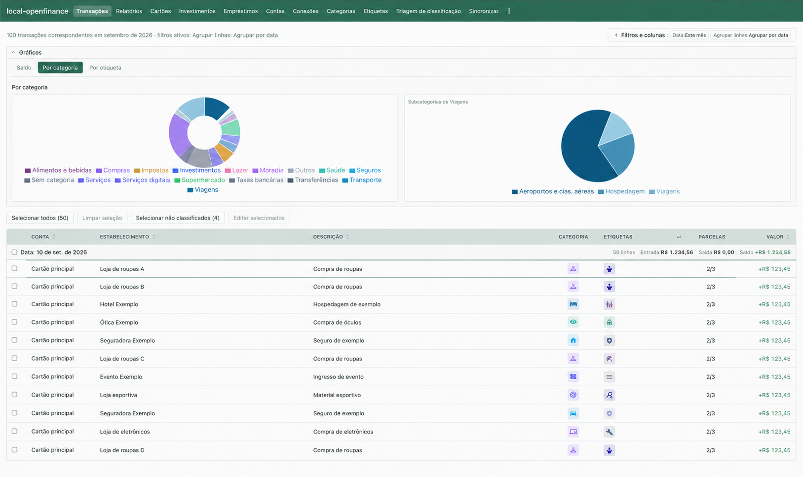
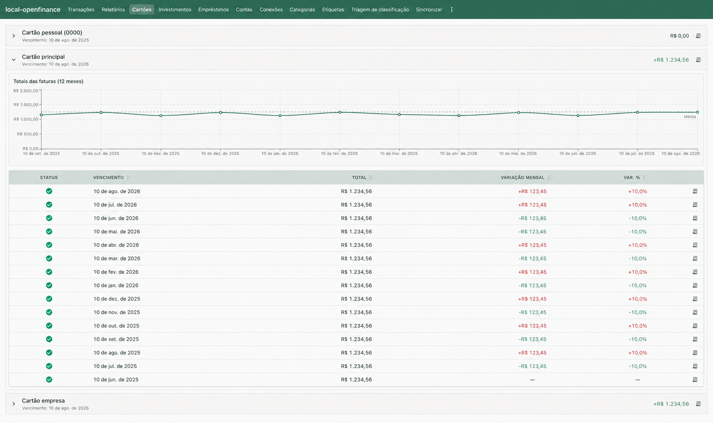
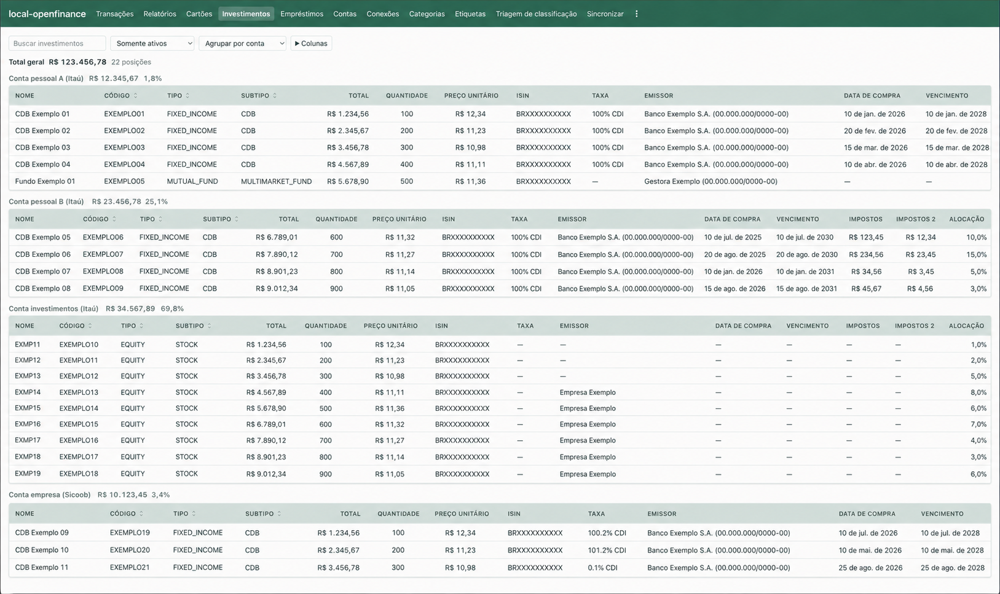
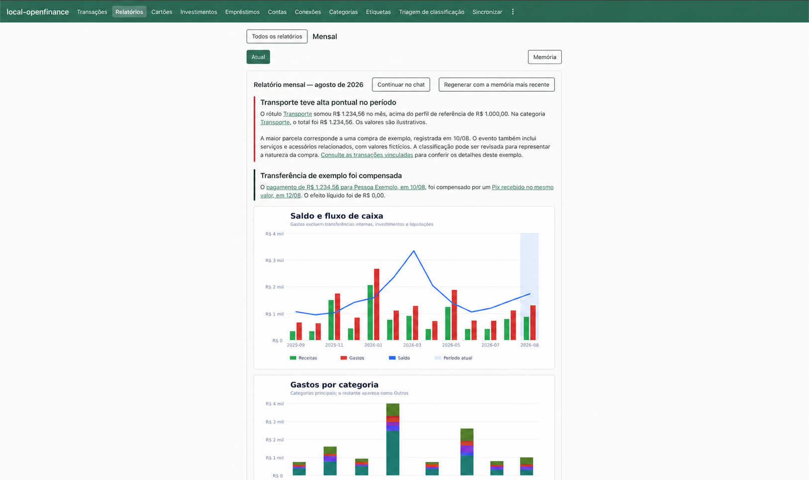
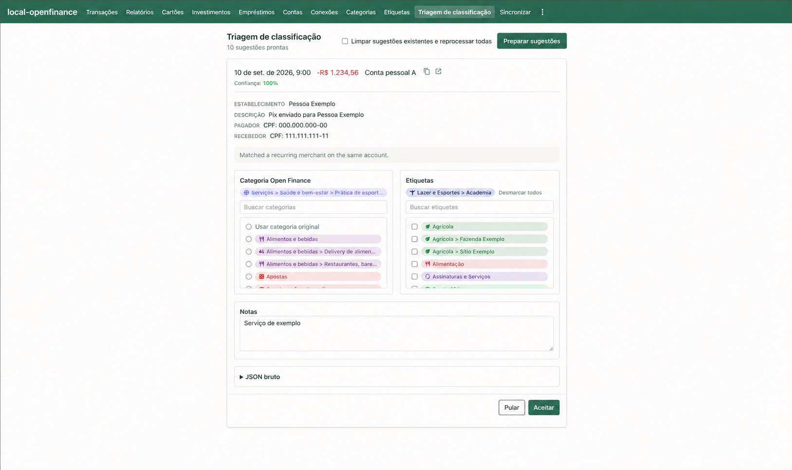

# local-openfinance

A personal **localhost web app** for Brazilian Open Finance. It syncs data from
[Banco MCP](https://banco.mcp.ai/) into SQLite on your machine. You browse
transactions, classify spend, and read named reports in the browser.

The CLI installs the app, keeps it running, and does batch jobs (sync, backup,
email). Day to day you use the web UI at `http://127.0.0.1:3847`.

Technically this is a TypeScript CLI (yargs) plus a Vite/React UI, Ajv-validated
JSON configs, Vercel AI SDK reports, optional Ollama, and SQLite via Node's
built-in `node:sqlite` (Node 26+).

## What it is good for

**Household expenses in the browser** — filter and classify merchants, then open weekly/monthly reports. Example topic: [`examples/expenses/`](./examples/expenses/).

### Features

These screenshots illustrate selected features of local-openfinance. The interface is shown in Brazilian Portuguese (pt-BR) because the software is designed for Brazil and its Open Finance ecosystem.

> **NOTE:** Personal information and financial figures have been anonymized or replaced with illustrative examples. The displayed data is not consistent within or across screenshots: amounts, totals, percentages, and charts may not match and should not be treated as actual financial records.

#### Transactions

Browse and filter transactions, group entries by date, and explore spending by category or label. The table brings together accounts, merchants, descriptions, categories, labels, installments, and amounts, with options for bulk editing.



#### Credit cards

Review cards and their statement history, including due dates, payment status, totals, and monthly changes. A chart summarizes statement totals over time.



#### Investments

View investment positions grouped by account, with portfolio totals and details such as asset type, quantity, unit price, issuer, purchase date, maturity, taxes, and allocation.



#### Monthly reports

Read financial highlights alongside charts of cash flow, balances, and spending by category. Open linked transactions, continue the analysis in chat, or regenerate a report using the latest memory.



#### Classification review

Review suggested transaction categories and labels, including confidence and an explanation. Inspect transaction details, adjust the classification, add notes, and accept or skip each suggestion.




## Data source

The REST contract is documented in [`banco-mcp-openapi.json`](./banco-mcp-openapi.json) (base URL `https://api.mcp.ai`). Authentication uses a bearer workspace API key:

- `OPENFINANCE_API_KEY` — required for sync
- `OPENFINANCE_BASE_URL` — optional; defaults to `https://api.mcp.ai/api/openfinance`

The CLI writes a local SQLite database (default `openfinance.sqlite` beside your config). Sync is incremental: cursors per resource avoid re-fetching unchanged history.

## Setup

Linux and macOS are the expected hosts. Ask an agent (Grok, OpenClaw, …) to
follow [`.agents/skills/setup/SKILL.md`](.agents/skills/setup/SKILL.md). That
ends with the web UI kept running and a daily backup+sync.

Manual first run:

```bash
nvm use                 # Node 26+, see .nvmrc
pnpm install
cp .env.example .env
# set OPENFINANCE_API_KEY, a model key, TZ, LOG_LEVEL=warn
# LOCAL_OPENFINANCE_WEB_TOKEN=$(openssl rand -hex 32)
pnpm run build
```

Connect banks in the Banco MCP workspace first. This app does not create Open
Finance consents.

Copy a private topic (prompt paths are relative to the config file):

```bash
mkdir -p "$HOME/local-openfinance"
cp examples/expenses-minimal-config.json "$HOME/local-openfinance/expenses-config.json"
cp -R examples/expenses "$HOME/local-openfinance/"
# set storage.databasePath and model.provider / model.model
pnpm run local-openfinance validate-config --config "$HOME/local-openfinance/expenses-config.json"
```

`TZ` (for example `America/Sao_Paulo`) is used for report windows and compact
LLM state. When unset, the process uses the system timezone.

## Keep the web UI running

`maintain --serve` is the long-running entrypoint: dated SQLite backup, prune
copies older than 30 days, bind the UI on `127.0.0.1`, then sync in the
background so the UI is up during the fetch.

Build once (`pnpm run build`) so `dist/bundle/local-openfinance.mjs` and
`dist/client` exist. `.env` in the clone supplies keys and the web token.

### Linux (systemd user units)

Units in [`examples/systemd/`](./examples/systemd/) match a typical user
session:

| Unit | Role |
|------|------|
| `local-openfinance.service` | Always on: `maintain --serve` |
| `local-openfinance-daily.timer` | 05:00 local, restart the service (new backup + sync) |
| `local-openfinance-reports.timer` | Hourly `run --due --send` (30-minute timeout) |

Copy the five files to `~/.config/systemd/user/`. In the two `.service` files
that run Node, set `WorkingDirectory` to this clone, `ExecStart` to your Node
26 binary (`command -v node` after `nvm use`), and `--config` to your topic
JSON. Then:

```bash
systemctl --user daemon-reload
systemctl --user enable --now local-openfinance.service
systemctl --user enable --now local-openfinance-daily.timer
systemctl --user enable --now local-openfinance-reports.timer
```

On a machine without a lingering user session, `loginctl enable-linger "$USER"`
so the units survive logout.

`Persistent=true` on the timers catches a missed 05:00 or hourly fire after
boot. `--due` only selects reports for the current local date. It does not
backfill a missed weekly or monthly day.

```bash
systemctl --user list-timers
journalctl --user -u local-openfinance.service -f
```

### macOS (launchd)

Plists in [`examples/launchd/`](./examples/launchd/) are the same three jobs:

| Label | Role |
|-------|------|
| `ai.mcp.local-openfinance` | KeepAlive: `maintain --serve` |
| `ai.mcp.local-openfinance-daily` | 05:00 `launchctl kickstart -k` of that job |
| `ai.mcp.local-openfinance-reports` | Hourly `run --due --send` |

Substitute `__CLONE__`, `__NODE__`, `__CONFIG__`, `__HOME__`, and `__UID__`
(`id -u`), copy to `~/Library/LaunchAgents/`, then:

```bash
uid="$(id -u)"
launchctl bootstrap "gui/${uid}" ~/Library/LaunchAgents/ai.mcp.local-openfinance.plist
launchctl bootstrap "gui/${uid}" ~/Library/LaunchAgents/ai.mcp.local-openfinance-daily.plist
launchctl bootstrap "gui/${uid}" ~/Library/LaunchAgents/ai.mcp.local-openfinance-reports.plist
launchctl enable "gui/${uid}/ai.mcp.local-openfinance"
launchctl enable "gui/${uid}/ai.mcp.local-openfinance-daily"
launchctl enable "gui/${uid}/ai.mcp.local-openfinance-reports"
launchctl kickstart -k "gui/${uid}/ai.mcp.local-openfinance"
```

On older macOS, `launchctl load -w` of each plist is the equivalent of
bootstrap+enable.

Logs go to `~/Library/Logs/local-openfinance*.log`.

### Restore and one-shot CLI

To restore, stop the service, replace `storage.databasePath` with a backup,
remove leftover `-wal` / `-shm` files, and start the service again.

For a one-off without units:

```bash
pnpm run local-openfinance maintain --config "$HOME/local-openfinance/expenses-config.json" --serve
```

## Web UI

Personal localhost dashboard, **not** production-grade auth. See
[`SECURITY.md`](./SECURITY.md).

Open `http://127.0.0.1:3847/?token=YOUR_TOKEN` once. The token is stored in
`sessionStorage`. Log out (icon after Sync) clears it.

Tab order: Transactions → Reports → Credit Cards → Investments → Loans →
Accounts → Connections → Categories → Labels → Classify triage → Sync.

Transactions detail shows merchant business name, MCC, purchase date, and
credit-card statement bill when synced metadata provides them.

### Tailscale Services (optional)

To reach the same localhost UI from other devices on your tailnet via a stable MagicDNS name, announce it as a [Tailscale Service](https://tailscale.com/docs/features/tailscale-services) when `serve` starts:

1. Define the Service in the [admin console](https://login.tailscale.com/admin/services) (for example name `local-openfinance`, endpoint `tcp:443`).
2. Ensure this host uses a **tag-based** Tailscale identity (required for Service hosts).
3. Set the env var or CLI flag, then start serve:

```bash
export LOCAL_OPENFINANCE_TAILSCALE_SERVICE=local-openfinance
# optional: LOCAL_OPENFINANCE_TAILSCALE_HTTPS_PORT=443

pnpm run local-openfinance serve --config examples/expenses-config.json
# or: --tailscale-service=local-openfinance
```

On start the app runs `tailscale serve --service=svc:… --https=443 127.0.0.1:<port>` (configure + advertise). On SIGINT/SIGTERM it drains the Service so new connections stop while the process exits. The UI remains bound to **127.0.0.1** only; Tailscale proxies into that loopback port. Token auth is still required. Approve the host in the admin console if auto-approval is not configured.

Set `web.publicBaseUrl` to the MagicDNS origin (no token in that URL) so report
emails can link back into the UI.

Development with hot reload (not the daily path):

```bash
pnpm run dev:web
# UI http://127.0.0.1:5173 — API proxied to :3847
```

Static mockups: [`docs/web-mockups/index.html`](./docs/web-mockups/index.html).

## Commands

The web UI is the primary interface. These commands are for setup, sync,
reports, and automation.

Development (TypeScript via `tsx`):

```bash
pnpm run local-openfinance validate-config --config examples/expenses-config.json
pnpm run local-openfinance inspect-config --config examples/expenses-config.json
pnpm run local-openfinance sync --config examples/expenses-config.json
pnpm run local-openfinance classify --config examples/expenses-config.json
pnpm run local-openfinance detect-transfers --config examples/expenses-config.json --date=this-month
pnpm run local-openfinance label-connection --config examples/expenses-config.json
pnpm run local-openfinance label-account --config examples/expenses-config.json
pnpm run local-openfinance link-accounts --config examples/expenses-config.json
pnpm run local-openfinance check-database --config examples/expenses-config.json
pnpm run local-openfinance check-database --config examples/expenses-config.json --repair --backup ./openfinance.backup.sqlite
pnpm run local-openfinance maintain --config examples/expenses-config.json
pnpm run local-openfinance maintain --config examples/expenses-config.json --serve
pnpm run local-openfinance run --config examples/expenses-config.json --report weekly
pnpm run local-openfinance run --config examples/expenses-config.json --due --send
pnpm run local-openfinance rebuild-memory --config examples/expenses-config.json --quantity all
```

`sync` writes progress to **stderr** (phase, current item, page `current/total` and %) unless you pass `--quiet`. Completed connections and accounts leave persistent trail lines (`✓`) with fetched counts (transactions, loans, …). Merged alias accounts are not synced. Transaction fetch uses Banco MCP `detail: "raw"` (merchant business name, CNPJ, credit-card `billId`, MCC, purchase date when the institution provides them). Pass `--force-upsert` (alias `--force`) or set `sync.forceUpsert: true` to re-fetch and upsert all rows, bypassing incremental skips for categories, transactions, and investment transactions (useful after schema changes that add parsed detail columns).

`check-database` runs `PRAGMA quick_check`. Use `--repair` to rebuild FTS indexes (`transactions_fts`, `annotation_notes_fts`) when they drift from their content tables (for example after schema changes). Optional `--backup` writes a copy via `VACUUM INTO` before repair; `--vacuum` rewrites the database file afterward. If quick check still fails after repair, back up annotations/state if needed, remove the SQLite file (and any `-wal` / `-shm` siblings), and run `sync` again.

`maintain` writes a restorable daily copy of the current database (`VACUUM INTO`), deletes dated backups older than `--keep-days` (default 30), then runs `sync` and the usual post-sync classify-suggestion batch. Files land in `<database-stem>-backups/` beside the database (override with `--backup-dir`) as `<stem>-YYYY-MM-DD.sqlite`. Same-day reruns replace that date's file. Pass `--no-sync` to only backup and prune. Pass `--serve` to start the local web UI right after backup/prune, then run sync as the same background job the Sync tab starts.

`detect-transfers` requires `--date` or `--start-date`/`--end-date` to limit the scan scope.

List locally synced data (pagination + field filters):

```bash
pnpm run local-openfinance list-connections --config examples/expenses-config.json --limit=10 --offset=0
pnpm run local-openfinance list-connections --config examples/expenses-config.json --group-by=status
pnpm run local-openfinance list-connections --config examples/expenses-config.json --json
pnpm run local-openfinance list-accounts --config examples/expenses-config.json --name.contains=Ita
pnpm run local-openfinance list-accounts --config examples/expenses-config.json --group-by=account,type
pnpm run local-openfinance list-accounts --config examples/expenses-config.json --json
pnpm run local-openfinance list-transactions --config examples/expenses-config.json --date=this-month
pnpm run local-openfinance list-transactions --config examples/expenses-config.json --date=2026-06
pnpm run local-openfinance list-transactions --config examples/expenses-config.json --account=acc-id-1,acc-id-2
pnpm run local-openfinance list-transactions --config examples/expenses-config.json --group-by=date
pnpm run local-openfinance list-credit-cards --config examples/expenses-config.json
pnpm run local-openfinance list-credit-cards --config examples/expenses-config.json --group-by=account
pnpm run local-openfinance list-credit-cards --config examples/expenses-config.json --json
pnpm run local-openfinance list-credit-card-bills --config examples/expenses-config.json --due_date.ge=2026-01-01
pnpm run local-openfinance list-credit-card-bills --config examples/expenses-config.json --group-by=account,due_date
pnpm run local-openfinance list-credit-card-bills --config examples/expenses-config.json --json
pnpm run local-openfinance credit-card-details "card name or account id" --config examples/expenses-config.json
pnpm run local-openfinance credit-card-details "card name or account id" --config examples/expenses-config.json --json
pnpm run local-openfinance list-investments --config examples/expenses-config.json
pnpm run local-openfinance list-investments --config examples/expenses-config.json --status=all
pnpm run local-openfinance list-investments --config examples/expenses-config.json --group-by=account,type,subtype
pnpm run local-openfinance list-investments --config examples/expenses-config.json --json
pnpm run local-openfinance list-loans --config examples/expenses-config.json
pnpm run local-openfinance list-loans --config examples/expenses-config.json --group-by=account,type
pnpm run local-openfinance list-loans --config examples/expenses-config.json --json
pnpm run local-openfinance list-categories --config examples/expenses-config.json --name.contains=Food
pnpm run local-openfinance list-transfer-groups --config examples/expenses-config.json
```

Filter flags use `--FIELD.OPERATOR=VALUE` where `OPERATOR` is one of `contains`, `eq`, `ne`, `lt`, `gt`, `le`, `ge` (valid operators depend on the field type). Pagination: `--limit` (default 50) and `--offset` (default 0). `list-connections` groups by `connector`, highlights display name, branch/account, upstream connector, status, and supports `--json`. `list-accounts` groups by `account,type,subtype`, highlights display name, type/subtype, branch/account, and balance, and supports `--json`. `list-credit-cards` groups by `account,subtype`, highlights display name, card number, balance, and credit limits, and supports `--json`. `list-credit-card-bills` groups by `account,payment_status`, highlights due date, total, minimum payment, and payment status, and supports `--json`. `credit-card-details <account>` resolves a synced credit card and calls Banco MCP live for bill detail fields (`payments`, `financeCharges`, `--json`). `list-investments` prints a grouped chalk summary by default (`--group-by=account,type,subtype,name`, `--status=ACTIVE`, `--json`). `list-loans` groups by `account,type,name`, highlights `contractAmount` and `dueDate`, and supports `--json`. `list-transactions` groups by `account,date` (oldest dates first) with per-group credit/debit/balance totals; shows configured account names, upstream categories via `categories` join (translated by default, `--no-translate` for original), local annotations/labels, `⇄` transfer flags, and card installments; filters: `--status`, `--account` (CSV ids), `--category-id`, `--merchant` (regexp), `--payment-type`, `--date` shortcuts (`today`, `this-week`, `this-month`, `YYYY`, `YYYY-MM`, …) plus `--start-date` / `--end-date`; when `--group-by` omits `account`, each line suffixes the account name; `--json`.

List output includes `display_name` (and related `account_display_name` / `connection_display_name` fields). Manual connection labels (`label-connection`) apply to **connections only** (`display_name`, `connector_name`). Account names use manual labels (`label-account`) when set; otherwise bank accounts use `bankData.transferNumber` and credit cards use `BRAND (last4)` or `BRAND (LEVEL)`. Account rows also surface parsed `raw_json` details (`credit_data`, `transfer_number`, `branch` / `account` for bank rows).

### Connection labels

When several synced connections share the same upstream `connector_id` / `connector_name`, distinguish them with `label-connection`:

```bash
pnpm run local-openfinance label-connection --config examples/expenses-config.json
pnpm run local-openfinance label-connection --config examples/expenses-config.json \
  --item-id ITEM_UUID --branch 1234 --account 56789-0 --name "Itaú Personal"
```

The interactive picker shows each connection’s **last few transactions** (default 5, override with `--recent-limit`) so duplicate upstream connector names can be told apart. Recent transactions are printed again before editing the label fields.

### Account labels

Set a friendly name for an individual account (checking, credit card, etc.) with `label-account`:

```bash
pnpm run local-openfinance label-account --config examples/expenses-config.json
pnpm run local-openfinance label-account --config examples/expenses-config.json \
  --account-id ACCOUNT_UUID --name "Main checking"
```

The interactive picker shows each account’s **last few transactions** (default 5) plus the connection name so similar accounts can be told apart. Use `--clear` to remove a manual label and fall back to the default display name.

### Category labels

Open Finance upstream categories can be customized with `label-category` or the web **Categories** tab (name, Material icon, color). Defaults for all top-level categories (and sub-category overrides where the icon differs) ship in [`src/data/openfinance-category-defaults.json`](./src/data/openfinance-category-defaults.json); sync applies them to `category_labels` without overwriting manual edits. Child categories inherit icon/color from parents when their own label omits either field.

```bash
pnpm run local-openfinance label-category --config examples/expenses-config.json
pnpm run local-openfinance label-category --config examples/expenses-config.json \
  --category-id CATEGORY_ID --icon MdRestaurant --color '#f97316'
```

### Duplicate accounts (same card, multiple connections)

When one physical credit card is synced once per connection, merge the duplicate account rows with `link-accounts` so only the **canonical** account is visible, synced, listed, classified, and searched. Running the command without flags starts an interactive wizard that suggests duplicates matching `type`, `subtype`, and `transfer_number`, or lets you review existing linked groups to unlink or dissolve them. You can exit at any prompt without making changes.

```bash
pnpm run local-openfinance link-accounts --config examples/expenses-config.json
pnpm run local-openfinance link-accounts --config examples/expenses-config.json \
  --canonical CANONICAL_ACCOUNT_ID --alias ALIAS_ID --alias OTHER_ALIAS_ID
pnpm run local-openfinance link-accounts --config examples/expenses-config.json \
  --canonical CANONICAL_ACCOUNT_ID --clear
pnpm run local-openfinance link-accounts --config examples/expenses-config.json \
  --unlink ALIAS_ACCOUNT_ID
```

The interactive flow detects duplicate accounts by `type`, `subtype`, and `transfer_number`, suggests groups to link, or reviews existing linked groups for unlink/dissolve. It shows recent transactions per account (default 3, override with `--recent-limit`) when choosing canonical and alias rows. Exit choices leave the database unchanged.

Generate one named report, preview it without writes, or run every scheduled
report currently due:

```bash
pnpm run local-openfinance run --config examples/expenses-config.json --report weekly
pnpm run local-openfinance run --config examples/expenses-config.json --report weekly --dry-run
pnpm run local-openfinance run --config examples/expenses-config.json --due --send
```

Ad-hoc `--report` runs accept `--date` or a complete
`--start-date`/`--end-date` override. `--due` uses each report's local schedule
and skips an occurrence already persisted for that cadence and local date.

Bundled CLI after build:

```bash
pnpm run build
pnpm run local-openfinance:bundle validate-config --config examples/expenses-config.json
```

### Post-sync classify wizard

Pass `--classify` on `sync` to run the `@inquirer/prompts` wizard for newly synced entries that lack local annotations. Otherwise run `classify` separately when you are ready.

Reports render a plain-text HTML fallback in the terminal. The Reports web tab
shows sanitized report HTML, stored run history, and charts. Its streaming chat is
scoped to one named report and can continue from a selected stored run.

## Configuration

Topic configs are JSON files validated by [`schemas/config.schema.json`](./schemas/config.schema.json). The topic id is inferred from the filename (`expenses-config.json` → `expenses`).

Required fields: `report`, `model`.

### `storage`

| Field | Description |
|-------|-------------|
| `databasePath` | Local SQLite file populated by `sync`. Default: `openfinance.sqlite` beside the config. |

SQLite is the only persistence layer (synced Open Finance data, annotations
with normalized labels, embeddings, transfer links, intelligence memory,
stored report runs and charts, report-scoped taxonomy policies, and report chat
transcripts).

### `sync`

| Field | Description |
|-------|-------------|
| `forceBeforeFetch` | When `true`, call Banco MCP force-sync before incremental fetch. Default: `false`. |
| `forceUpsert` | When `true`, re-fetch and upsert all rows: skip no known ids, paginate full transaction and investment-transaction history, and refresh categories. Investments, accounts, loans, and bills always upsert on every sync. Default: `false`. |
| `connections` | Optional connection selectors (`item_id`, `connector_id`, or name). Default: all connections. |
| `lookbackDays` | Overlap when resuming transaction fetch per account. Default: `7`. Pagination stops once a page’s oldest row is before this window (API lists newest first); rows whose ids are already local are skipped. |
| `pageSize` | Default page size for paginated list endpoints (1–500). Default: `100`. |

### `annotation`

| Field | Description |
|-------|-------------|
| `embedding` | Embedding model (`provider`, `model`, optional `baseUrl` and `pricing`) for similarity against manual classifications. Stored vectors record provider token usage and estimated cost when pricing is present. |
| `classifier` | Optional classifier model to rank category suggestions. |
| `similarityThreshold` | Minimum cosine similarity to surface embedding matches (0–1). Default: `0.82`. |
| `pushCategoriesUpstream` | Ignored. Local classifications stay in SQLite. Default: `false`. |

### `report`

| Field | Description |
|-------|-------------|
| `accountIds` | Optional account uuid allow-list. |
| `includeUnannotated` | When `false`, only annotated entries are sent to the model. Default: `true`. |

### `reports`

Optional ordered list of named reports. An omitted or empty list leaves the Reports catalog empty.

| Field | Description |
|-------|-------------|
| `id` | Required stable slug. Use lowercase letters, digits, and single hyphens. The values `chat`, `memory`, `run`, and `history` are reserved. IDs must be unique. |
| `name` | Required display name. |
| `schedule` | Required local schedule. See the schedule table below. |
| `window` | Required date window: `last-complete-day`, `last-complete-week`, or `last-complete-month`. |
| `prompts` | Required non-empty ordered list of `@DEFAULT_BASE_INSTRUCTIONS@` tokens or Markdown paths relative to the config file. |
| `language` | Supported report locale (`en-US` or `pt-BR`) for text, translated taxonomy names, dates, numbers, and charts. Default: `pt-BR`. Keep it stable for a report. |
| `send` | Delivery policy: `always`, `alerts`, or `never`. Default: `always`. |
| `model` | Optional report-specific model. Uses the top-level `model` when omitted. |
| `agentBudget` | Optional agent-loop limits with `analystMaxSteps` (2–16, default 8), `reviewerMaxSteps` (2–8, default 4), and `reviewerRounds` (1–2, default 2). An uncached taxonomy policy can add one provider call, so the default complete-run ceiling is 17. |
| `accountIds` | Optional non-empty account UUID allow-list. Uses `report.accountIds` when omitted. |
| `includeUnannotated` | Optional override for `report.includeUnannotated`. |

Schedules use the local timezone:

| Kind | Required fields | Constraints |
|------|-----------------|-------------|
| `daily` | `time` | `HH:mm`, from `00:00` through `23:59`. |
| `weekly` | `weekday`, `time` | Lowercase weekday name and `HH:mm`. |
| `monthly` | `day`, `time` | `day` is 1 through 28 or `last`; `time` is `HH:mm`. |
| `manual` | None | Runs only through `run --report <id>`. |

The expenses example uses weekly and monthly prompt overlays under
[`examples/expenses/`](examples/expenses/). Its monthly report runs on day 8
and uses the complete preceding calendar month. The expenses example pair
(`examples/expenses-config.json` and `examples/expenses-minimal-config.json`)
resolves to the same behavior. The full file includes loader defaults; the
minimal file omits them.

### `model`

| Field | Description |
|-------|-------------|
| `provider` | `openai`, `anthropic`, `google`, `xai`, `openrouter`, `opencode`, `openai-compatible`, `gateway`, or `ollama`. |
| `model` | Provider-specific model name. |
| `baseUrl` | Optional custom endpoint for compatible providers. |
| `temperature` | Sampling temperature (omitted for reasoning models). |
| `maxOutputTokens` | Output token cap. |
| `reasoningEffort` | OpenAI-only reasoning level: `none`, `minimal`, `low`, `medium`, `high`, `xhigh`, or `max`. |
| `pricing` | Optional USD-per-million token rates (`input`, optional `cachedInput`, and `output`) persisted with model usage. |

Named reports use `model` unless their `reports[].model` overrides it. Live chat uses `chatModel` when set, otherwise `model`. The classifier stays under `annotation.classifier`.

`pricing.input`, `pricing.cachedInput`, and `pricing.output` are non-negative
numbers. Report cost remains unknown when a required rate or token count is
missing. Embeddings use `pricing.input` only.

### `chatModel`

Optional. Same fields as `model`. When omitted, chat uses `model`.

### `web`

| Field | Description |
|-------|-------------|
| `publicBaseUrl` | Public origin for permalinks in emails (for example a Tailscale Service URL). Do not put the web token in this URL. Optional; hash-only links when omitted. |

### `intelligence`

| Field | Description |
|-------|-------------|
| `suggestionConfidenceThreshold` | Minimum pending-suggestion score used by report analysis. Lower-scored suggestions remain unclassified. Default: `0.82`. |
| `minReportedItemAmountCents` | Hide individual transactions below this absolute amount from report item lists. Totals and charts still include them. Default: `10000` (R$100.00). |
| `rareLookbackYears` | Years of history for rare large events. Default: `3`. Range: 1–10. |

### `notify.smtp`

Used by `run --due --send` and CLI/background sync suggestion digests. Website
sync does not send the digest.

The password is never stored in JSON. `auth.passEnvVar` is the **name** of an
environment variable. Put the secret in `.env` under that name. The expenses
examples use `SMTP_PASS` with Gmail STARTTLS on port 587:

```json
"notify": {
  "smtp": {
    "host": "smtp.gmail.com",
    "from": "you@example.com",
    "to": "you@example.com",
    "auth": { "user": "you@example.com", "passEnvVar": "SMTP_PASS" }
  }
}
```

```bash
# .env (Gmail: 16-character App Password, not the account password)
SMTP_PASS=
```

| Field | Description |
|-------|-------------|
| `host` | SMTP hostname. Required when `notify.smtp` is present. |
| `port` | SMTP port (1–65535). Default: `587`. |
| `secure` | TLS from connection start. Default: `false`; in that mode the server must support STARTTLS before authentication or delivery. |
| `from` | Sender email. |
| `to` | Recipient email, or an array of recipients. |
| `auth.user` | SMTP username. Required when `auth` is set. |
| `auth.passEnvVar` | Name of the env var that holds the SMTP password. Required when `auth` is set. |

## Persistence

### SQLite (sync layer)

Normalized tables for connections, accounts, transactions (FTS5), investments, bills, categories, annotations (`annotation_categories`, `annotation_labels`, `entry_annotation_labels`), embeddings, transfer groups, and manual `connection_labels` (branch, account, name). Full DDL and indexing rules: [`PLAN.md`](./PLAN.md).

## Scoring helper models

Example configs under `examples/` use the OpenAI provider for annotation
embeddings and the assist classifier (requires `OPENAI_API_KEY`):

- embedding: `text-embedding-3-small`
- classifier: `gpt-4.1-mini`

OpenRouter, Google, and local Ollama remain supported. Smoke-check local models
with:

```bash
pnpm run ollama:embeddings
pnpm run ollama:classifier
```

Defaults: `nomic-embed-text` and `qwen3:0.6b`. Override with `OLLAMA_EMBEDDINGS_MODEL`, `OLLAMA_CLASSIFIER_MODEL`, and `OLLAMA_URL`.

## Development

```bash
pnpm run qa          # check, build, test, typecheck, React Doctor
pnpm run check:fix   # Biome auto-fix
pnpm run test:watch
```

`.husky/pre-commit` runs `pnpm run qa` and must stay that way. GitHub Actions
`.github/workflows/qa.yml` runs the same command on `master`/`main` and pull
requests. CI does not use `.env` and does not call model providers.

See [`SECURITY.md`](./SECURITY.md) for the personal-use threat model.

Agent and contributor conventions: [`AGENTS.md`](./AGENTS.md). Local annotation
categories are created in the CLI `classify` wizard. The web Categories tab only
edits Open Finance category presentation.

## License

GPL-3.0-or-later — see [`LICENSE`](./LICENSE).
